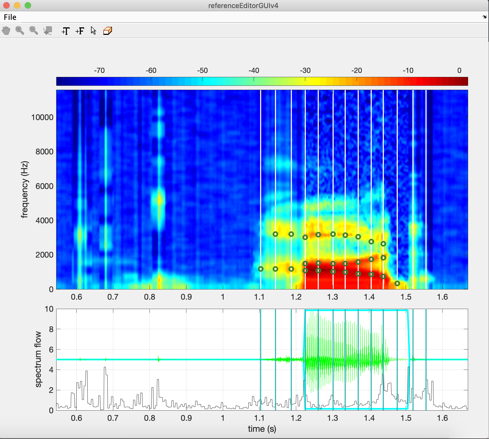
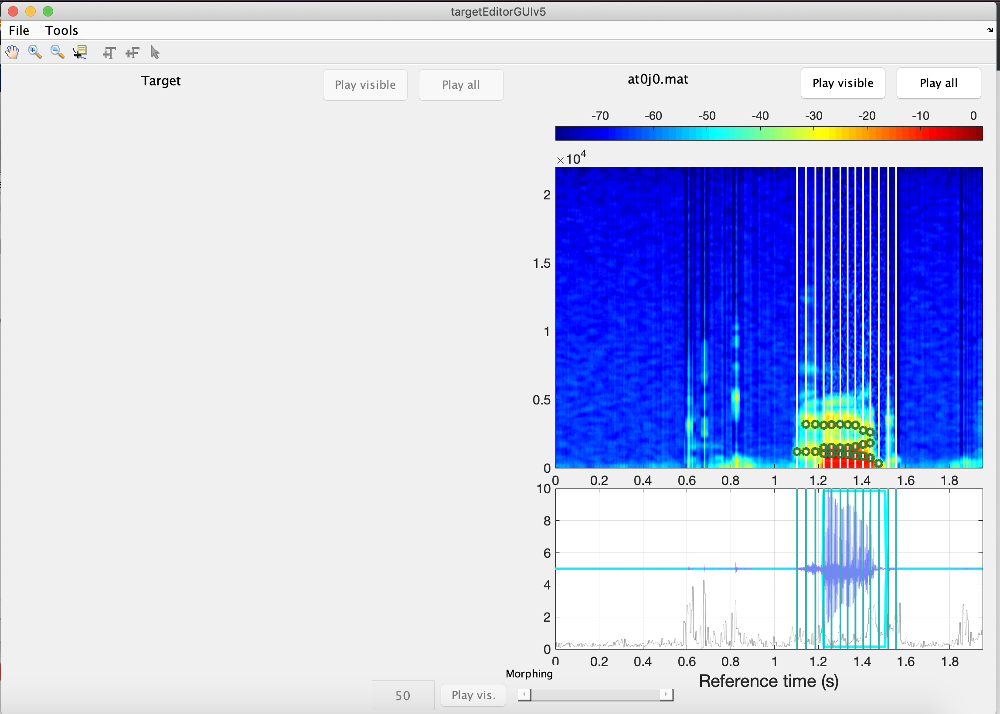
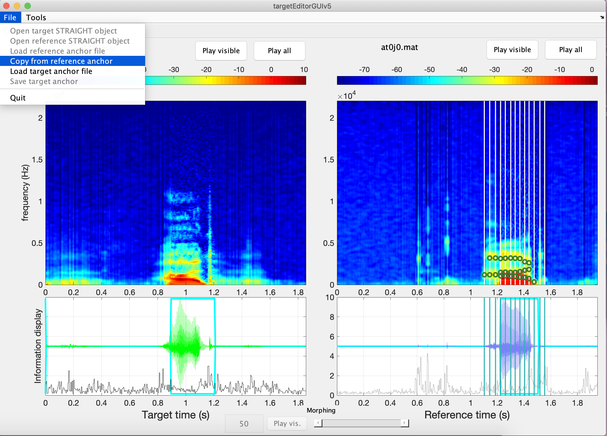
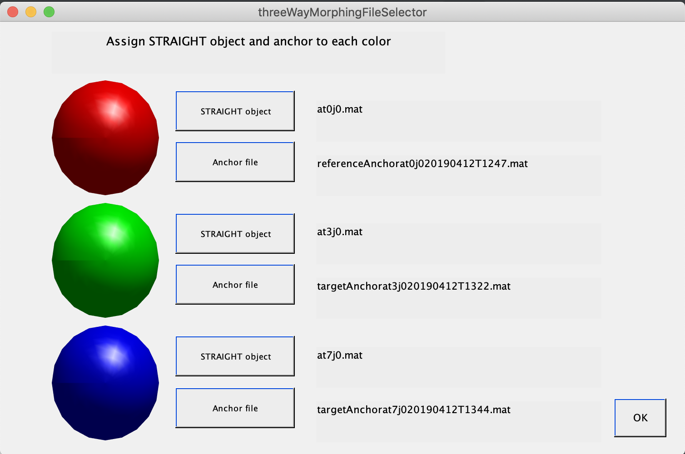
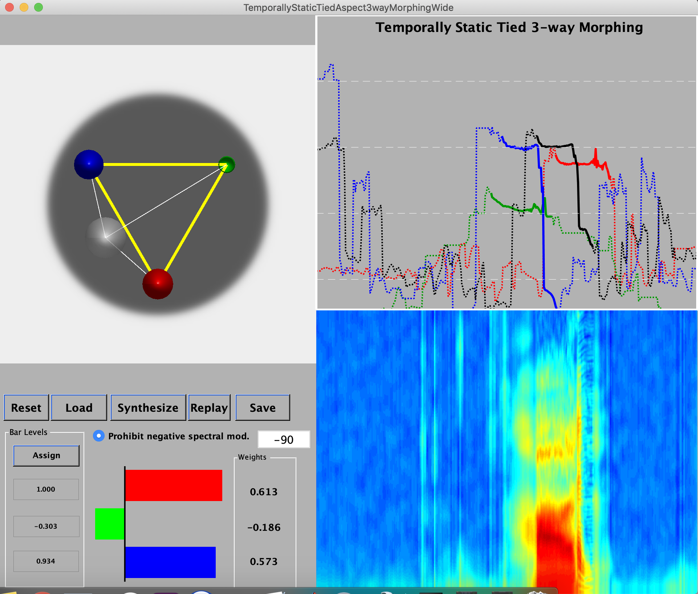

# quick Tandem N-way morphing tutorial

* Necessary packages: 
    *  TandemSTRAIGHTmonolithicPackage014
    * nwayMorphingProgs20151008 (or current version)
        * contact the creator of Tandem - **Dr. Hideki Kawahara** for access to the programs (http://web.wakayama-u.ac.jp/~kawahara/index-e.html)

## N-way morphing

* Step 1, pray to the gods that this program won’t crash on you
* Step 2, because this uses straight object files, you will have to FIRST analyze your audio files in the ’TandemSTRAIGHThandler’ in order to extract the F0, Aperiodicity, and STRAIGHT spectrum for each file and save them as FILE.mat. For review, see (https://memcauliffe.com/straight_workshop/)
* Now, you’re ready to start n-way morphing
* Step 3, you’ll want to create reference .mat files using ‘referenceEditorGUIv4’ in Matlab 
    1. open the referenceEditorGUIv4
    2. open the mat file you want to use as reference by clicking on File, open Straight object
    3. then you need to set temporal anchors by pressing the ’+T’ in the ribbon (The buttons can by kind of finicky, you might need to press the button to use the tool and press it again to “put the tool away”. Otherwise you might not be able to switch between tools)
    4. Then you can use the temporal anchors to add Formant reference points by clicking on the ‘+F'
    
    5. save the file and you’re done with this step.

  
* Step 4, you’re going to create a target .mat file using ’targetEditorGUIv5’ in Matlab
    1. open the target editor
    2. open your target straight object file (NOT the file you just made in the reference editor, but the first .mat file you made for the audio)
    3. THEN open the reference file for the same straight object and it will populate with the formant and temporal anchors you just created
    
    4. open your target straight object file for the next audio
        (You’ll use the reference file as…wait for it… a reference for the next straight object)
    4. click on “copy from reference anchor” in File and it will populate the information from the reference onto the target StrObj
    
    5. Move the copied reference targets to match the actual formant and temporal values on your target and save the file 
    6. repeat this step for the rest of your files

    
* Step 5, put everything together using the ’threewaymorphingFileSelector’ (if you’re morphing more than three files, you’ll have to use the ‘temporallyStaticBatchMorphing’ which also requires a text file with references to the locations of each straight object and it’s reference/target anchor information - you can see http://web.wakayama-u.ac.jp/~kawahara/tSTRAIGHT/TVNmorphingBatchE-1.pdf for a detailed explanation) 
    1. open the morphing GUI
    2.  click on the corresponding buttons to add the straight object and anchor file for each speaker (orb?)
    
    3. and click ok! Now you have the file with all three speakers and you can load this into your morphing interface
*  Step 6, putting it all together in the ’temporallyStaticTiedAspect3WayMorphing’ (or the batch morphing for more than 3)
    1. Open the GUI
    2. load the bundle .mat file you made in the previous step
    3. now you can manipulate the orbs (?) or fill in the values in the editor to create morphs between voices. You can then save it as a .wav file by pressing the save button.
    

